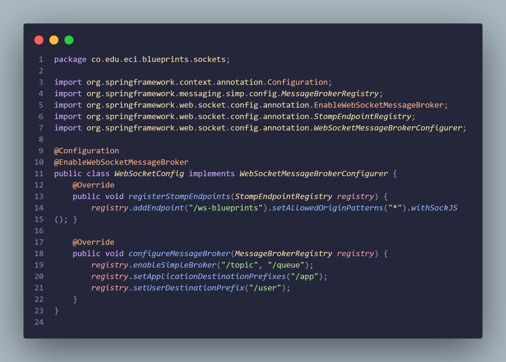
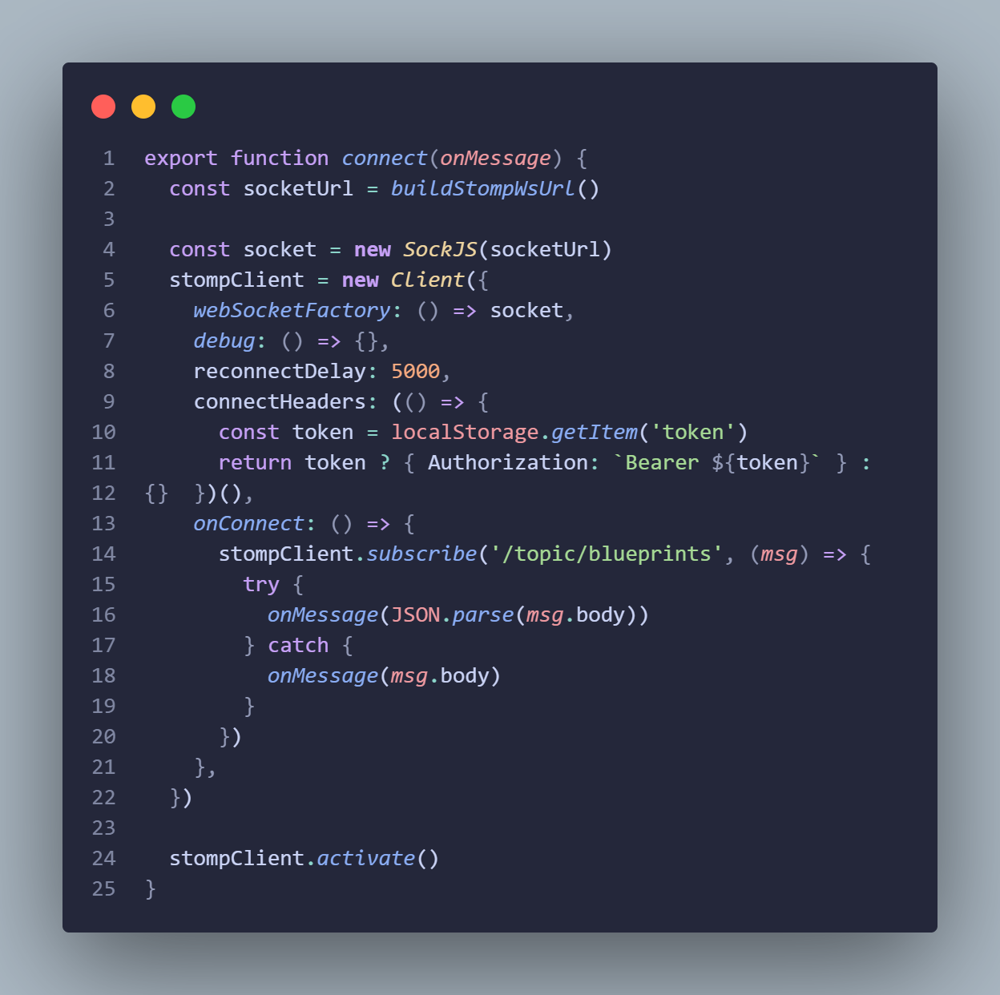
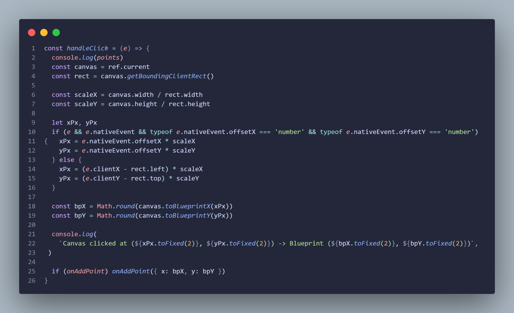

# Lab7-ARSW — Blueprints (Frontend + Backend)

Este repositorio contiene dos servicios:

- `backend/` — API en Java (Spring Boot, Maven). Escucha en el puerto 8080.
- `frontend/` — cliente React + Vite. Está configurado para servirse en el puerto 4173.

Hay 2 formas de ejecutar el proyecto:

1) Ejecutar carpetas por separado (desarrollo rápido)
2) Ejecutar ambos servicios con Docker Compose (una sola orden)

---

## 1) Ejecutar por carpetas separadas (desarrollo)

Requisitos:

- Java 21 (para el backend)
- Maven
- Node.js 20+ y npm

Backend (desde la raíz del repo):

- Nos movemos a la carpeta que contiene el back
```powershell
cd backend
```

- Instalamos dependencias y demás que necesite maven y el back para correr
```powershell
mvn clean install
```

- Ejecutamos la aplicación
```powershell
mvn spring-boot:run
```

El backend estará disponible en http://localhost:8080. 

Frontend (desde la raíz del repo):

- Nos movemos a la carpeta que contiene el front
```powershell
cd frontend
```

- Instalamos librerias y demás cosas que necesite el front
```powershell
npm install
```

- Ejecutamos la aplicación
```powershell
npm run dev
```

---

## 2) Ejecutar con Docker Compose

Se añadió un `docker-compose.yml` en la raíz que construye y levanta ambos servicios:

- backend: construido desde `./backend` y publicado en el puerto `8080`.
- frontend: construido desde `./frontend`, sirve el bundle estático con `serve` en `4173`.

- Comando para levantar ambos servicios:

```powershell
docker compose up --build
```
- Comandos varios
```powershell
# Reconstruir solo el frontend
docker compose build frontend
docker compose up -d

# Ver logs
docker compose logs -f --tail=200

# Parar y eliminar contenedores
docker compose down
```

Notas importantes sobre la configuración del frontend dentro del contenedor:

- El frontend usa una variable de entorno de build llamada ```VITE_API_BASE_URL```. Esta variable define la URL base del backend. En el archivo docker-compose.yml está configurada como ```http://localhost:8080```, ya que el backend expone el puerto ```8080``` en el host.
---

### 📂 Estructura del proyecto
```
backend
├───src
│   └───main
│       ├───java
│       │   └───co
│       │       └───edu
│       │           └───eci
│       │               └───blueprints
│       │                   │   BlueprintsApiApplication.java
│       │                   │
│       │                   ├───api
│       │                   │       BlueprintController.java
│       │                   │
│       │                   ├───auth
│       │                   │       AuthController.java
│       │                   │
│       │                   ├───config
│       │                   │       OpenApiConfig.java
│       │                   │
│       │                   ├───controllers
│       │                   │       BlueprintsAPIController.java
│       │                   │
│       │                   ├───dto
│       │                   │       ApiResponse.java
│       │                   │
│       │                   ├───filters
│       │                   │       BlueprintsFilter.java
│       │                   │       IdentityFilter.java
│       │                   │       RedundancyFilter.java
│       │                   │       UndersamplingFilter.java
│       │                   │
│       │                   ├───model
│       │                   │       Blueprint.java
│       │                   │       Point.java
│       │                   │
│       │                   ├───persistence
│       │                   │       BlueprintNotFoundException.java
│       │                   │       BlueprintPersistence.java
│       │                   │       BlueprintPersistenceException.java
│       │                   │       InMemoryBlueprintPersistence.java
│       │                   │
│       │                   ├───security
│       │                   │       InMemoryUserService.java
│       │                   │       JwtKeyProvider.java
│       │                   │       MethodSecurityConfig.java
│       │                   │       RsaKeyProperties.java
│       │                   │       SecurityConfig.java
│       │                   │
│       │                   ├───services
│       │                   │       BlueprintBroadcastService.java
│       │                   │       BlueprintsServices.java
│       │                   │
│       │                   └───sockets
│       │                           WebSocketConfig.java

frontend
├───src
    │   App.jsx
    │   main.jsx
    │   styles.css
    │
    ├───components
    │       BlueprintCanvas.jsx
    │       BlueprintForm.jsx
    │       BlueprintList.jsx
    │
    ├───features
    │   └───blueprints
    │           blueprintsSlice.js
    │
    ├───pages
    │       BlueprintDetailPage.jsx
    │       BlueprintsPage.jsx
    │       LoginPage.jsx
    │       NotFound.jsx
    │
    ├───services
    │       apiClient.js
    │       blueprintsApiClient.js
    │       blueprintsApiMock.js
    │       blueprintsService.js
    │       wsClient.js
    │
    └───store
            index.js
```

### 🚀 Funcionalidad general
La aplicación permite:
1. Visualizar todos los blueprints disponibles
2. Crear nuevos blueprints asignados a un autor
3. Agregar nuevos puntos en tiempo real a los blueprints y que otros usuarios conectados puedan verlo 

### 🔗 Rutas principales

| Método | Endpoint                      | Descripción                            |
| ------ | ----------------------------- | -------------------------------------- |
| `GET`  | `/blueprints`                 | Lista todos los blueprints             |
| `GET`  | `/blueprints/{author}`        | Lista los blueprints de un autor       |
| `GET`  | `/blueprints/{author}/{name}` | Obtiene un blueprint específico        |
| `POST` | `/blueprints`                 | Crea un nuevo blueprint                |
| `PUT`  | `/blueprints/{author}/{name}` | Agrega puntos a un blueprint existente |

### 📡Comunicación en tiempo real

Para esta aplicación usamos STOMP como método de comunicación en tiempo real mediante web-sockets, definimos los tópicos a los que se podrán suscribir los clientes, haciendo que cada vez que se haga una actualización se envíe una notificación mediante el canal que permanece abierto, permitiendo que estas actualizaciones se vean al instante en todas las pantallas.


Por el lado del front configuramos la conexión STOMP para que el usuario pueda hacer click en el lienzo y los puntos se envíen vía web sockets según la posición relativa del ratón del cliente


Lógica de pintar puntos mediante clicks en el canvas


### 🎞️ Comprobación del funcionamiento
[Link del video](https://drive.google.com/file/d/1DLtppJPNrLa334HSytBo7sQlt-YhMzVz/view?usp=sharing)    